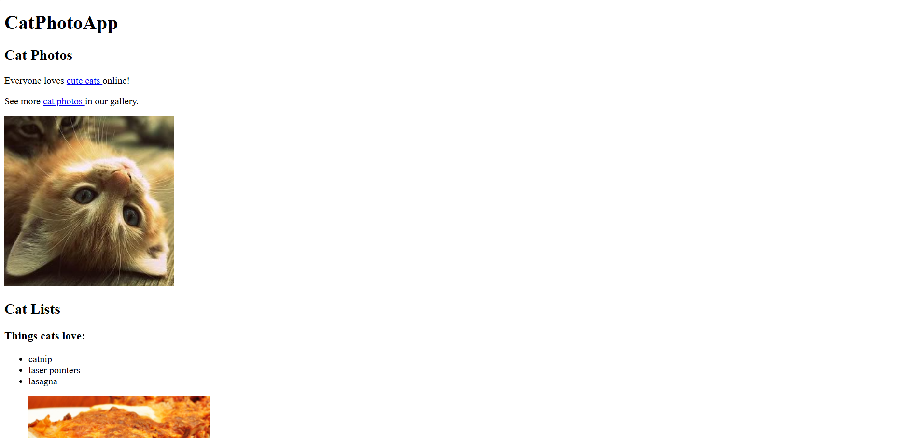
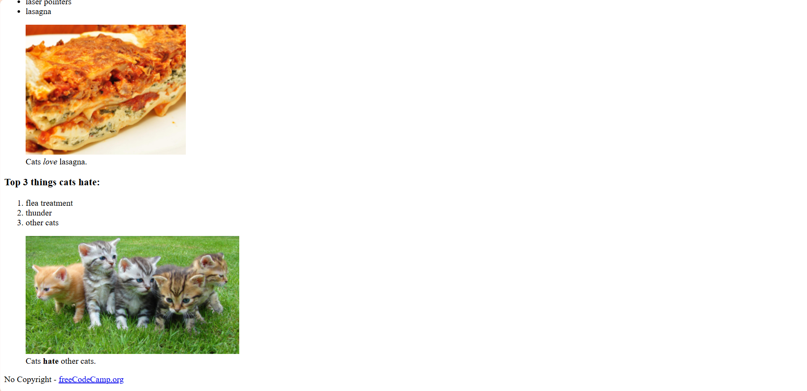

# 🐱 CatPhotoApp  

This repository contains my first basic HTML project, **CatPhotoApp**, which I completed during my freeCodeCamp Full-Stack Developer Curriculum track.  

## 📌 About the Project  
CatPhotoApp is a simple webpage built with HTML to practice fundamental web development concepts. The project includes:  
- 🖼️ Images and links  
- 📑 Lists (ordered and unordered)  
- 🔤 Text formatting (emphasis, strong importance)  

## 🚀 Technologies Used  
- **HTML5**  

## 📷 Preview  
Check out the project:
  

👩‍💻 Developed with ❤️ by [Isabela Class](https://github.com/isabelaclass)
